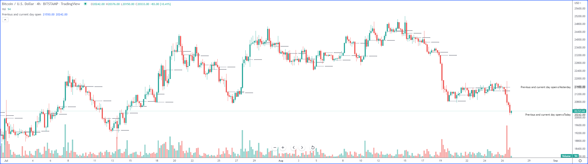
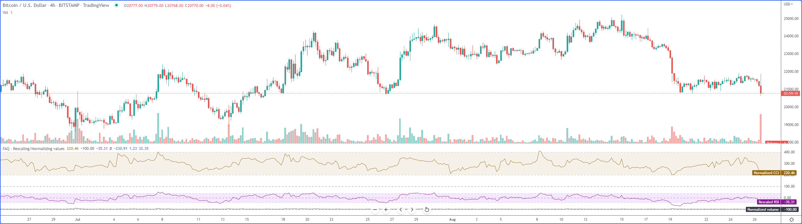
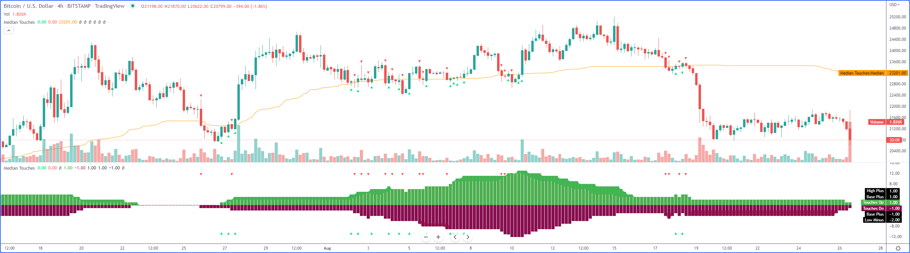
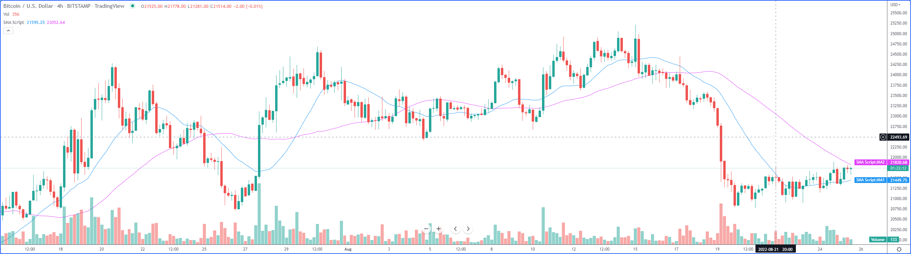
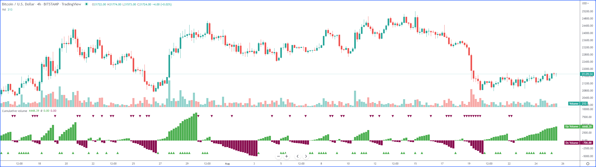

.. image:: /images/Pine_Script_logo.svg
   :alt: Pine Script™ logo
   :target: https://www.tradingview.com/pine-script-docs/en/v5/Introduction.html
   :align: right
   :width: 100
   :height: 100

   
.. _PageTechniquesFaq:

Techniques FAQ
==============

.. contents:: :local:
    :depth: 3

How do I prevent the ‘x1 is too far from the current bar_index’ error?
------------------------------------------------------------------

How can I update all x2/right side of all lines/boxes in an \'array.new_line()\' / \'array.new_box()\'?
-----------------------------------------------------------------------------------------------

How to avoid repainting when using the \'request.security()\' function?
-----------------------------------------------------------

See the discussion published with the PineCoders indicator script: 
`How to avoid repainting when using request.security() <https://www.tradingview.com/script/cyPWY96u-How-to-avoid-repainting-when-using-security-PineCoders-FAQ/>`__

The easiest way is to use the following syntax for v5:

::

    request.security(syminfo.tickerid, "D", close[1], lookahead = barmerge.lookahead_on)

This is how you do it for v4:

::

    security(syminfo.tickerid, "D", close[1], lookahead = barmerge.lookahead_on)

And this is the method for v3:

::

    security(tickerid, "D", close[1], lookahead = barmerge.lookahead_on)

How to avoid repainting when NOT using the \'request.security()\' function?
---------------------------------------------------------------

See the discussion published with the PineCoders indicator script: 
`How to avoid repainting when NOT using request.security() <https://www.tradingview.com/script/s8kWs84i-How-to-avoid-repainting-when-NOT-using-security/>`__

The general idea is to use the confirmed information from the last bar for calculations.

How can I trigger a condition only when a number of bars have elapsed since the last condition occurred?
--------------------------------------------------------------------------------------------------------

Use the `ta.barssince() <https://www.tradingview.com/pine-script-reference/v5/#fun_ta{dot}barssince>`__ function.

::

    //@version=5
    indicator("Bars since example", overlay = true)
    len = input(3)
    cond = close > open and close[1] > open[1]
    trigger = cond and ta.barssince(cond[1]) > len - 1
    plotchar(cond)
    plotchar(trigger, "", "O", color = color.new(color.red, 0))

How can my script identify what chart type is active?
-----------------------------------------------------

Use everget’s `Chart Type Identifier <https://www.tradingview.com/script/8xCRJkGR-RESEARCH-Chart-Type-Identifier/>`__.

How can I plot the chart’s historical high and low?
---------------------------------------------------

How can I remember when the last time a condition occurred?
-----------------------------------------------------------

How can I plot the previous and current day’s open?
---------------------------------------------------

We define a period through the script’s Settings/Inputs, in this case 1 day. 
Then we use the `time() <https://www.tradingview.com/pine-script-reference/v5/#fun_time>`__ function to detect changes in the period, and when it changes, 
save the running `open <https://www.tradingview.com/pine-script-reference/v5/#var_open>`__ in the the previous day’s variable, 
and get the current `open <https://www.tradingview.com/pine-script-reference/v5/#var_open>`__.

Note the plots using a choice of lines or circles. When using the lines, rather than use 
`plot.style_linebr <https://www.tradingview.com/pine-script-reference/v5/#var_plot{dot}style_linebr>`__ and plot 
`na <https://www.tradingview.com/pine-script-reference/v5/#var_na>`__ on changes so we don’t get a diagonal plot between the levels, we simply don’t use a color on changes, 
which leaves a void of one bar rather the void of 2 bars used when we plot an `na <https://www.tradingview.com/pine-script-reference/v5/#var_na>`__ value.

    
::

    //@version=5
    indicator("Previous and current day open", "", true)
    string period = input.timeframe("D", "Period after which hi/lo is reset")
    bool lines = input.bool(true)

    var float oYesterday = na
    var float oToday = na
    if ta.change(time(period))
        oYesterday := oToday
        oToday := open

    stylePlots = lines ? plot.style_line : plot.style_circles
    plot(oYesterday, "oYesterday", lines and ta.change(time(period)) ? na : color.gray, 2, stylePlots)
    plot(oToday, "oToday", lines and ta.change(time(period)) ? na : color.silver, 2, stylePlots)

How can I count the occurrences of a condition in the last x bars?
------------------------------------------------------------------

How can I implement an On/Off switch?
--------------------------------------

::

    //@version=5
    indicator("On/Off condition example", "", true)
    upBar = close > open
    // On/off conditions.
    triggerOn = upBar and upBar[1] and upBar[2]
    triggerOff = not upBar and not upBar[1]
    // Switch state is implicitly saved across bars thanks to initialize-only-once keyword "var".
    var onOffSwitch = false
    // Turn the switch on when triggerOn is true. If it is already on,
    // keep it on unless triggerOff occurs.
    onOffSwitch := triggerOn or onOffSwitch and not triggerOff
    bgcolor(onOffSwitch ? color.new(color.green, 90) : na)
    plotchar(triggerOn, "triggerOn", "▲", location.belowbar, color.new(color.lime, 0), size = size.tiny, text = "On")
    plotchar(triggerOff, "triggerOff", "▼", location.abovebar, color.new(color.red, 0), size = size.tiny, text = "Off")

How can I allow transitions from condition A►B or B►A, but not A►A nor B►B
--------------------------------------------------------------------------

One way to do it is by using `ta.barssince() <https://www.tradingview.com/pine-script-reference/v5/#fun_ta{dot}barssince>`__. This method is more flexible and faster:

::

    //@version=5
    //@author=LucF, for PineCoders
    indicator("AB or BA example", "", true)

    // ————— Trigger conditions.
    bool upBar        = close > open
    bool condATrigger = upBar and upBar[1]
    bool condBTrigger = not upBar and not upBar[1]
    // ————— Conditions. These variable will only be true/false on the bar where they occur.
    bool condA = false
    bool condB = false
    // ————— State variable set to true when last triggered condition was A, and false when it was condition B.
    // This variable"s state is propagated troughout bars (because we use the "var" keyword to declare it).
    var bool LastCondWasA = false

    // ————— State transitions so that we allow A►B or B►A, but not A►A nor B►B.
    if condATrigger and not LastCondWasA
        // The trigger for condA occurs and the last condition set was condB.
        condA := true
        LastCondWasA := true
    else
        if condBTrigger and LastCondWasA
            // The trigger for condB occurs and the last condition set was condA.
            condB := true
            LastCondWasA := false

    bgcolor(LastCondWasA ? color.new(color.green, 90) : na)
    plotchar(condA, "condA", "▲", location.belowbar, color.new(color.lime, 30), size = size.tiny, text = "A")
    plotchar(condB, "condB", "▼", location.abovebar, color.new(color.red, 30), size = size.tiny, text = "B")
    // Note that we do not plot the marker for triggers when they are allowed to change states, since we then have our condA/B marker on the chart.
    plotchar(condATrigger and not condA, "condATrigger", "•", location.belowbar, color.new(color.green, 0), size = size.tiny, text = "a")
    plotchar(condBTrigger and not condB, "condBTrigger", "•", location.abovebar, color.new(color.maroon, 0), size = size.tiny, text = "b")

Can I merge two or more indicators into one?
--------------------------------------------

Sure, but start by looking at the scale each one is using. If you’re thinking of merging a moving average indicator designed to plot on top of candles and in relation to them, 
you are going to have problems if you also want to include an indicator showing volume bars in the same script because their values are not using the same scale.

Once you’ve made sure your scaling will be compatible (or you have devised a way of normalizing/re-scaling them), 
it’s a matter of gathering the code from all indicators into one script and removing any variable name collisions so each indicator’s calculations retain their independence 
and integrity. You may need to convert some code from one version of Pine Script™ to another, so pay attention to the version used in each script.

.. note:: If the indicators you’ve merged are CPU intensive, you may run into runtime limitations when executing the compound script.

How can I rescale an indicator from one scale to another?
---------------------------------------------------------

The answer depends on whether you know the minimum/maximum possible values of the signal to be rescaled. 
If you don’t know them, as is the case for `volume <https://www.tradingview.com/pine-script-reference/v5/#var_volume>`__ or 
`ta.macd() <https://www.tradingview.com/pine-script-reference/v5/#fun_ta{dot}macd>`__ where the maximum value is unknown, 
then you will need to use a function that uses past history to determine the minimum/maximum values, as in the ``normalize()`` function here. 
While this is an imperfect solution since the minimum/maximum need to be discovered as your script progresses bar to bar, we prefer it to the technique using 
`ta.lowest() <https://www.tradingview.com/pine-script-reference/v5/#fun_ta{dot}lowest>`__ and 
`ta.highest() <https://www.tradingview.com/pine-script-reference/v5/#fun_ta{dot}highest>`__ over a fixed period because it uses the minimum/maximum values for the complete set 
of elapsed bars rather than a subset of fixed length. 
The ideal solution would be to know in advance the minimum/maximum values for the whole series prior to beginning the normalization process, 
but this is currently not possible in Pine.

If you know the minimum/maximum values of the series (RSI, Stoch, etc.), then you should use the ``rescale()`` function, 
which only translates the values into another space without changing their relative proportion.

Here, we show how to present `ta.rsi() <https://www.tradingview.com/pine-script-reference/v5/#fun_ta{dot}rsi>`__ and 
`volume <https://www.tradingview.com/pine-script-reference/v5/#var_volume>`__ in one part of our our indicator’s pane, in the -100/100 range. 
As `ta.rsi() <https://www.tradingview.com/pine-script-reference/v5/#fun_ta{dot}rsi>`__ is a bounded indicator with known values between 0/100, 
we can rescale it to the -100/100 and not lose any of its information. `Volume <https://www.tradingview.com/pine-script-reference/v5/#var_volume>`__, however, is another story. 
As it is unbounded, we need to normalize it to the same -100/100 scale because we want its plot line to be constrained to the same space as our rescaled 
`ta.rsi() <https://www.tradingview.com/pine-script-reference/v5/#fun_ta{dot}rsi>`__. 
`Volume <https://www.tradingview.com/pine-script-reference/v5/#var_volume>`__ is shown as the black line.

In addition to `ta.rsi() <https://www.tradingview.com/pine-script-reference/v5/#fun_ta{dot}rsi>`__ and 
`volume <https://www.tradingview.com/pine-script-reference/v5/#var_volume>`__ in one part of our indicator’s space, let’s say we also want to show 
`ta.cci() <https://www.tradingview.com/pine-script-reference/v5/#fun_ta{dot}cci>`__ which is an unbounded indicator. 
While 75% of its values should lie in the -100/100 space, there are no fixed upper/lower bounds for 
`ta.cci() <https://www.tradingview.com/pine-script-reference/v5/#fun_ta{dot}cci>`__ since it is unbounded. We will thus need to normalize the value. 
We choose to present it in the 100/500 space of our indicator. 
`ta.cci() <https://www.tradingview.com/pine-script-reference/v5/#fun_ta{dot}cci>`__ is normally displayed with lines at -100 and 100, 
but in the 100/500 bounded space where we are normalizing it, there is no precise equivalent for the -100 and 100 levels, so we arbitraly decided on 200/400:

::

    //@version=5
    //@author=glaz + LucF, for PineCoders
    indicator("FAQ - Rescaling/Normalizing values")

    // ————— When the scale of the signal to rescale is unknown (unbounded).
    // Min/Max of signal to rescale is determined by its historical low/high.
    normalize(src, min, max) =>
        // Normalizes series with unknown min/max using historical min/max.
        // src      : series to rescale.
        // min, max : min/max values of rescaled series.
        var historicMin = 10e10
        var historicMax = -10e10
        historicMin := math.min(nz(src, historicMin), historicMin)
        historicMax := math.max(nz(src, historicMax), historicMax)
        min + (max - min) * (src - historicMin) / math.max(historicMax - historicMin, 10e-10)

    // ————— When the scale of the signal to rescale is known (bounded).
    rescale(src, oldMin, oldMax, newMin, newMax) =>
        // Rescales series with known min/max.
        // src            : series to rescale.
        // oldMin, oldMax : min/max values of series to rescale.
        // newMin, newMax : min/max values of rescaled series.
        newMin + (newMax - newMin) * (src - oldMin) / math.max(oldMax - oldMin, 10e-10)

    // ————— Usual CCI calculations.
    int length = input.int(20, minval = 1)
    float src  = input.source(close, title = "Source")
    float ma   = ta.sma(src, length)
    float cci  = (src - ma) / (0.015 * ta.dev(src, length))

    // —————————— Plots

    // ————— Normalized CCI.
    plot(normalize(cci, 100, 500), "Normalized CCI", color = color.new(#996A15, 0))
    // Arbitrary and inexact equivalent of 100 and -100 levels rescaled to the 100/500 scale.
    band1 = hline(400, "Upper Band", color = #C0C0C0, linestyle = hline.style_dashed)
    band0 = hline(200, "Lower Band", color = #C0C0C0, linestyle = hline.style_dashed)
    fill(band1, band0, color = color.new(#9C6E1B, 90), title = "Background")

    // ————— Normalized volume in the same region as the rescaled RSI.
    plot(normalize(volume, -100, 100), "Normalized volume", color.new(color.black, 0))
    hline(100)
    hline(-100)

    // ————— Rescaled RSI.
    plot(rescale(ta.rsi(close, 14), 0, 100, -100, 100), "Rescaled RSI", color.new(#8E1599, 0))
    hline(0)
    // Precise equivalent of 70 and 30 levels rescaled to the -100/100 scale.
    band11 = hline(40, "Upper Band", color = #C0C0C0)
    band00 = hline(-40, "Lower Band", color = #C0C0C0)
    fill(band11, band00, color = color.new(#9915FF, 90), title = "Background")

    // ————— Plot actual values in Data Window.
    plotchar(na, "═══════════════", "", location.top, size = size.tiny)
    plotchar(cci, "Real CCI", "", location.top, size = size.tiny)
    plotchar(volume, "Real volume", "", location.top, size = size.tiny)
    plotchar(ta.rsi(close, 14), "Real RSI", "", location.top, size = size.tiny)

How can I calculate my script's run time?
-----------------------------------------

Use the code from the `PineCoders Script Stopwatch <>`__. 
You will be able to time your script execution time so you can explore different scenarios when developing code and see for yourself which version performs the best.

How can I save a value when an event occurs?
--------------------------------------------

How can I count touches of a specific level?
--------------------------------------------

This technique shows one way to count touches of a level that is known in advance (the median in this case). 
We keep a separate tally of up and down bar touches, and account for gaps across the median. Every time a touch occurs, we simply save a 1 value in a series. 
We can then use the `math.sum() <https://www.tradingview.com/pine-script-reference/v5/#fun_math{dot}sum>`__ function to count the number of ones in 
that series in the last ``lookBackTouches`` bars.

Note that the script can be used in overlay mode to show the median and touches on the chart, or in pane mode to show the counts. 
Change the setting of the overlay variable accordingly and re-add the indicator to the chart to implement the change.

::

    //@version=5
    //@author=LucF, for PineCoders

    // Median Touches
    //  v1.0, 2020.01.02 13:01 — LucF

    // Can work in overlay or pane mode and plots differently for each case.
    overlay = false
    indicator("Median Touches", "", overlay)
    int lookBackMedian  = input.int(100)
    int lookBackTouches = input.int(50)
    float median = ta.percentile_nearest_rank(close, lookBackMedian, 50)
    // Don"t count neutral touches when price doesn"t move.
    bool barUp = close > open
    bool barDn = close < open
    // Bar touches median.
    bool medianTouch = high > median and low < median
    bool gapOverMedian = high[1] < median and low > median
    bool gapUnderMedian = low[1] > median and high < median
    // Record touches.
    int medianTouchUp = medianTouch and barUp or gapOverMedian ? 1 : 0
    int medianTouchDn = medianTouch and barDn or gapUnderMedian ? 1 : 0
    // Count touches.
    float touchesUp = math.sum(medianTouchUp, lookBackTouches)
    float touchesDn = math.sum(medianTouchDn, lookBackTouches)
    // —————————— Plots
    // ————— Both modes
    // Markers
    plotchar(medianTouchUp, "medianTouchUp", "▲", overlay ? location.belowbar : location.bottom, color.new(color.lime, 0))
    plotchar(medianTouchDn, "medianTouchDn", "▼", overlay ? location.abovebar : location.top, color.new(color.red, 0))
    // ————— Overlay mode
    // Median for overlay mode.
    plot(overlay ? median : na, "Median", color.new(color.orange, 0))
    // ————— Pane mode
    // Base areas.
    lineStyle = overlay ? plot.style_line : plot.style_columns
    plot(not overlay ? touchesUp : na, "Touches Up", color.new(color.green, 0), style = lineStyle)
    plot(not overlay ? -touchesDn : na, "Touches Dn", color.new(color.maroon, 0), style = lineStyle)
    // Exceeding area.
    float minTouches = math.min(touchesUp, touchesDn)
    bool minTouchesIsUp = touchesUp < touchesDn
    basePlus = plot(not overlay ? minTouches : na, "Base Plus", #00000000)
    hiPlus = plot(not overlay and not minTouchesIsUp ? touchesUp : na, "High Plus", #00000000)
    fill(basePlus, hiPlus, color.new(color.lime, 0))
    baseMinus = plot(not overlay ? -minTouches : na, "Base Plus", #00000000)
    loMinus = plot(not overlay and minTouchesIsUp ? -touchesDn : na, "Low Minus", #00000000)
    fill(baseMinus, loMinus, color.new(color.red, 0))

What does the Return type of 'then' block (series[label]) is not compatible with return type of 'else' block (series[integer]) compilation error mean?
------------------------------------------------------------------------------------------------------------------------------------------------------

How can I know if something is happening for the first time since the beginning of the day?
-------------------------------------------------------------------------------------------

We show 3 techniques to do it. In the first, we use `ta.barssince() <https://www.tradingview.com/pine-script-reference/v5/#fun_ta{dot}barssince>`__ to check if the number 
of bars since the last condition, plus one, is greater than the number of bars since the beginning of the new day.

In the second and third methods we track the condition manually, foregoing the need for `ta.barssince() <https://www.tradingview.com/pine-script-reference/v5/#fun_ta{dot}barssince>`__. 
Method 2 is more readable. Method 3 is a more concise method.

::

    //@version=5
    indicator("First time since BOD example", "", true)
    bool cond = close > open

    // ————— Method 1.
    bool first1 = cond and ta.barssince(cond[1]) + 1 > ta.barssince(ta.change(time("D")))
    plotchar(first1, "first1", "•", location.top)

    // ————— Method 2.
    var bool allowTrigger2 = false
    bool first2 = false
    if ta.change(time("D"))
        allowTrigger2 := true
    if cond and allowTrigger2
        first2 := true
        allowTrigger2 := false
    plotchar(first2, "first2", "•", location.top, color = color.new(color.silver, 0), size = size.normal)

    // ————— Method 3.
    var bool allowTrigger3 = false
    bool first3 = false
    allowTrigger3 := ta.change(time("D")) or allowTrigger3 and not first3[1]
    first3 := allowTrigger3 and cond
    plotchar(first3, "first3", "•", location.top, color = color.new(color.orange, 0), size = size.large)

How can I optimize Pine Script™ code?
-------------------------------------

How can I access a stock's financial information using Pine Script™?
--------------------------------------------------------------------

How can I save a value from a signal when a pivot occurs?
---------------------------------------------------------

You will need to:

Detect a new pivot, which is done by testing for ``not na(pHi)``, as the pivot built-ins only return a non-na value when they identify a pivot. 
Keep in mind this always happens n bars after the pivot itself, with n corresponding to the number of bars you use as right legs to identify your pivots.
Save the value of the signal n bars back, because that is when the pivot was found.

::

    //@version=5
    indicator("Signal value on pivot")
    r = ta.rsi(close, 14)
    legs = input(12)
    pHi = ta.pivothigh(legs, legs)
    newPHi = not na(pHi)
    var float rHi = na
    if newPHi
        rHi := r[legs]
    plot(r, "Rsi value")
    plot(rHi, "Signal value", newPHi ? na : color.fuchsia, offset = -legs)
    plotchar(pHi, "pHi", "▲", location.top, offset = -legs)

How can I find the maximum value among the last pivots?
-------------------------------------------------------

We will be finding the highest value of the last 3 `high <https://www.tradingview.com/pine-script-reference/v5/#var_high>`__ pivots here, 
but the technique can be extended to any number of pivots. We will be using `ta.valuewhen() <https://www.tradingview.com/pine-script-reference/v5/#fun_ta{dot}valuewhen>`__ 
to fetch the value from the nth occurrence of a `high <https://www.tradingview.com/pine-script-reference/v5/#var_high>`__ pivot, 
remembering to offset the value we are retrieving with number of right legs used to detect the pivot, 
as a pivot is only detected after than number of bars has elapsed from the actual pivot bar.

::

    //@version=5
    indicator("Max pivot example", "", true)
    int legs    = input.int(4)
    float pH    = ta.pivothigh(legs, legs)
    bool newPH  = not na(pH)
    float p00   = ta.valuewhen(newPH, high[legs], 00)
    float p01   = ta.valuewhen(newPH, high[legs], 01)
    float p02   = ta.valuewhen(newPH, high[legs], 02)
    float maxPH = math.max(p00, p01, p02)
    plot(maxPH)
    plotchar(newPH, "newPH", "•", location.abovebar, offset = -legs)
    plotchar(newPH, "newPH", "▲", location.top)

.. note:: We use ``not na(pH)`` to detect a new pivot, rather than the more common way of simply relying on the fact that pH will be different from zero or na—so true—when a pivot is found. While the common technique will work most of the time, it will not work when a pivot is found at a value of zero, because zero is evaluated as false in a conditional expression. Our method is thus more robust, and the recommended way to test for a pivot.

How can I access normal bar OHLC values on a non-standard chart?
----------------------------------------------------------------

You need to use the `request.security() <https://www.tradingview.com/pine-script-reference/v5/#fun_request{dot}security>`__ function. 
This script allows you to view normal candles on the chart, although depending on the non-standard chart type you use, this may or may not make much sense:

::

    //@version=5
    indicator("Plot underlying OHLC", "", true)

    // ————— Allow plotting of underlying candles on chart.
    plotCandles = input(true, "Plot Candles")
    method = input.int(1, "Using Method", minval = 1, maxval = 2)

    // ————— Method 1: Only works when chart is on default exchange for the symbol.
    o1 = request.security(syminfo.ticker, timeframe.period, open)
    h1 = request.security(syminfo.ticker, timeframe.period, high)
    l1 = request.security(syminfo.ticker, timeframe.period, low)
    c1 = request.security(syminfo.ticker, timeframe.period, close)
    // ————— Method 2: Works all the time because it use the chart"s symbol and exchange information.
    ticker = ticker.new(syminfo.prefix, syminfo.ticker)
    o2 = request.security(ticker, timeframe.period, open)
    h2 = request.security(ticker, timeframe.period, high)
    l2 = request.security(ticker, timeframe.period, low)
    c2 = request.security(ticker, timeframe.period, close)
    // ————— Get value corresponding to selected method.
    o = method == 1 ? o1 : o2
    h = method == 1 ? h1 : h2
    l = method == 1 ? l1 : l2
    c = method == 1 ? c1 : c2

    // ————— Plot underlying close.
    plot(c, "Underlying close", color = color.new(color.gray, 0), linewidth = 3, trackprice = true)
    // ————— Plot candles if required.
    invisibleColor = color.new(color.white, 100)
    plotcandle(plotCandles ? o : na, plotCandles ? h : na, plotCandles ? l : na, plotCandles ? c : na, color = color.orange, wickcolor = color.orange)

    var table tbl = table.new(position.top_right, 1, 1)

    if barstate.isfirst
        table.cell(tbl, 0, 0, "", bgcolor = color.yellow)
    else if barstate.islast
        string txt = str.format("Underlying Close1 = {0, number, #.##}\nUnderlying Close2 = {1, number, #.##} \n{2} close = {3, number, #.##}\n Delta = {4, number, #.##}"
        , c1, c2, "Chart\'s", close, close - c)
        table.cell_set_text(tbl, 0, 0, txt)

How can I initialize a series on specific dates using external data?
--------------------------------------------------------------------

How can I display plot values in the chart’s scale?
---------------------------------------------------

To achieve this effect with your indicator, you need to check 2 checkboxes in the Scales tab inside the Chart Settings menu: 
``Indicators and financials name labels`` and ``Indicators and financials value labels``. 
You reach the Chart Settings menu by right-clicking on the chart or by using the cog wheel in the chart’s upper-left icons.

If you display the indicator’s name, the ``shorttitle`` will be used if there is one. If not, as is the case here, the title will be used. 
The plot’s name will also appear in the `label <https://www.tradingview.com/pine-script-reference/v5/#op_label>`__:

::

    //@version=5
    indicator("SMA Script", "", true)
    maOne = ta.sma(close, 20)
    maTwo = ta.sma(close, 50)
    plot(maOne, "MA1")
    plot(maTwo, "MA2", color.new(color.fuchsia, 0))

How can I reset a sum on a condition?
-------------------------------------

We first need a variable whose value is preserved bar to bar, so we will use the `var <https://www.tradingview.com/pine-script-reference/v5/#op_var>`__ keyword to 
initialize our ``vol`` variable on the first bar only. We then need to define the resetting condition, in this case a MACD cross. 
We then add the `volume <https://www.tradingview.com/pine-script-reference/v5/#var_volume>`__ to our ``vol`` variable on each bar, except when a cross occurs, 
in which case we reset our sum to zero. We also plot a dot on crosses for debugging purposes:

::

    //@version=5
    indicator("Reset sum on condition example")
    [macdLine, signalLine, _] = ta.macd(close, 12, 26, 9)
    var float vol = na
    bool cond = ta.cross(macdLine, signalLine)
    vol := cond ? 0. : vol + volume
    plot(vol)
    plotchar(cond, "cond", "•", location.top, size = size.tiny)

.. note:: We do not use the third tuple value in the `ta.macd() <https://www.tradingview.com/pine-script-reference/v5/#fun_ta{dot}macd>`__ call, so we replace it with an underscore.

How can I accumulate a value for two exclusive states?
------------------------------------------------------

We first need to define the conditions that will change our states. 
In this example, we use rising/falling conditions on `close <https://www.tradingview.com/pine-script-reference/v5/#var_close>`__. 
A state begins when its trigger condition occurs and lasts until the first occurrence of the trigger condition for the other state. 
Our triggers are ``beginUp`` and ``beginDn``.

We then declare the two variables that will hold our cumulative `volume <https://www.tradingview.com/pine-script-reference/v5/#var_volume>`__, one for each state. 
Since only one state can be active at any given moment, when we are cumulating for one state (using ``volUp`` for an uptrend, for example), 
the other variable (``volDn`` in this case) will hold the `na <https://www.tradingview.com/pine-script-reference/v5/#var_na>`__ value. 
We use the `var <https://www.tradingview.com/pine-script-reference/v5/#op_var>`__ keyword when declaring the variables so they preserve their value bar to bar.

The third and last step in our logic is to determine what value to set our cumulative variables with. We will use ``volUp`` in this discussion, so this line:

::

    volUp := beginDn ? na : beginUp and na(volUp) ? volume : volUp + volume

We must distinguish between three outcomes:

When a counter signal (``beginDn``) occurs, we set ``volUp`` to `na <https://www.tradingview.com/pine-script-reference/v5/#var_na>`__ as 
`volume <https://www.tradingview.com/pine-script-reference/v5/#var_volume>`__ will then start accumulating in the variable’s counterpart: ``beginDn ? na``
If we encounter a trigger (``beginUp``) and we are currently cumulating for a trend in the other direction (and ``na(volUp)``) then start a new cumulative count: 
``: beginUp and na(volUp) ? volume``
Otherwise we are already accumulating in that trend direction, so add the current `volume <https://www.tradingview.com/pine-script-reference/v5/#var_volume>`__ to the total: 
``: volUp + volume``

Here we display the cumulative count in Weis Wave fashion. We also display the occurrences of triggers for debugging purposes:

::

    //@version=5
    indicator("Cumulative volume", "")

    beginUp = ta.rising(close, 2)
    beginDn = ta.falling(close, 2)
    var float volUp = na
    var float volDn = na
    volUp := beginDn ? na : beginUp and na(volUp) ? volume : volUp + volume
    volDn := beginUp ? na : beginDn and na(volDn) ? volume : volDn + volume

    plot(volUp, "Up Volume", color.new(color.green, 0), 4, plot.style_columns)
    plot(-volDn, "Dn Volume", color.new(color.maroon, 0), 4, plot.style_columns)
    plotchar(beginUp, "Up Reset", "▲", location.bottom, color.new(color.green, 0), size = size.tiny)
    plotchar(beginDn, "Dn Reset", "▼", location.top, color.new(color.maroon, 0), size = size.tiny)

How can I organize my script’s inputs in the Settings/Inputs tab?
-----------------------------------------------------------------

How can I find the nth highest/lowest value in the last bars?
-------------------------------------------------------------

The ``nthHighest()`` and ``nthLowest()`` functions in this script use an `array <https://www.tradingview.com/pine-script-reference/v5/#op_array>`__ 
to hold the values of the last x bars and sort a copy of that `array <https://www.tradingview.com/pine-script-reference/v5/#op_array>`__ on each bar to search for the 
nth highest/lowest value. The distinct parameter allows you to determine if you allow similar values to count or not:

::

    //@version=5
    //@author=LucF, for PineCoders
    indicator("Nth Highest/Lowest Functions", "", true)

    int length       = input.int(50)
    int nth          = input.int(2)
    bool useDistinct = input.bool(false, "Distinct values")

    // ————— Function returns the nth highest source in the last length bars.
    nthHighest(source, length, nth, useDistinct) =>
        // source      : series to evaluate.
        // length      : past bars to evaluate.
        // nth         : nth highest value to return.
        // useDistinct : If true then only distinct values are considered.
        var sources = array.new_float(length)
        float result = na
        // Queue new value.
        array.push(sources, source)
        // De-queue oldest one.
        array.shift(sources)
        // Reorder values in a copy of the array to preserve our original series.
        sortedSources = array.copy(sources)
        array.sort(sortedSources, order.descending)
        // Find nth highest value.
        float previousVal = na
        nthExamined = 1
        for i = 0 to length - 1 by 1
            val = array.get(sortedSources, i)
            if useDistinct and val == previousVal
                // Skip same values.
                continue
            if nthExamined == nth
                // nth highest found.
                result := val
                break
            nthExamined += 1
            previousVal := val
        result

    // ————— Function returns the nth lowest source in the last length bars.
    nthLowest(source, length, nth, useDistinct) =>
        // source     : series to evaluate.
        // length     : past bars to evaluate.
        // nth        : nth lowest value to return.
        // useDistinct: If true then only distinct values are considered.
        var sources = array.new_float(length)
        float result = na
        // Queue new value.
        array.push(sources, source)
        // De-queue oldest one.
        array.shift(sources)
        // Reorder values in a copy of the array to preserve our original series.
        sortedSources = array.copy(sources)
        array.sort(sortedSources, order.ascending)
        // Find nth highest value.
        previousVal = float(na)
        nthExamined = 1
        for i = 0 to length - 1 by 1
            val = array.get(sortedSources, i)
            if useDistinct and val == previousVal
                // Skip same values.
                continue
            if nthExamined == nth
                // nth highest found.
                result := val
                break
            nthExamined += 1
            previousVal := val
        result

    nthHi = nthHighest(high, length, nth, useDistinct)
    nthLo = nthLowest(low, length, nth, useDistinct)
    hi = ta.highest(length)
    lo = ta.lowest(length)
    plot(nthHi, "nthHi", color.new(color.lime, 0))
    plot(hi)
    plot(nthLo, "nthLo", color.new(color.maroon, 0))
    plot(lo)
    bgcolor(nthLo == lo ? color.new(color.red, 90) : nthHi == hi ? color.new(color.green, 90) : na)

How can I calculate the all-time high and all-time low?
-------------------------------------------------------

Use the `ta.max() <https://www.tradingview.com/pine-script-reference/v5/#fun_ta{dot}max>`__ and the 
`ta.min() <https://www.tradingview.com/pine-script-reference/v5/#fun_ta{dot}min>`__ functions. These functions will return the all-time high and low for the given data source.

::

    //@version=5
    indicator("All-time high and low example")
    ath = ta.max(high)
    atl = ta.min(low)
    plot(ath, color = color.green)
    plot(atl, color = color.red)

.. image:: /images/TradingView-Logo-Block.svg
    :width: 200px
    :align: center
    :target: https://www.tradingview.com/